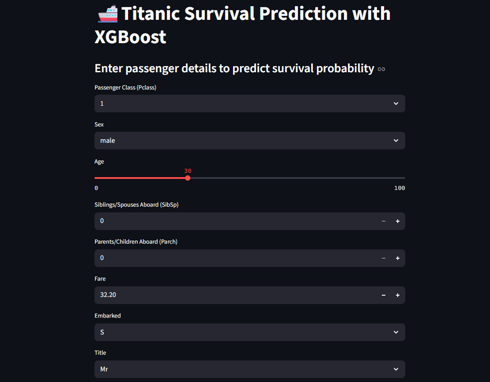
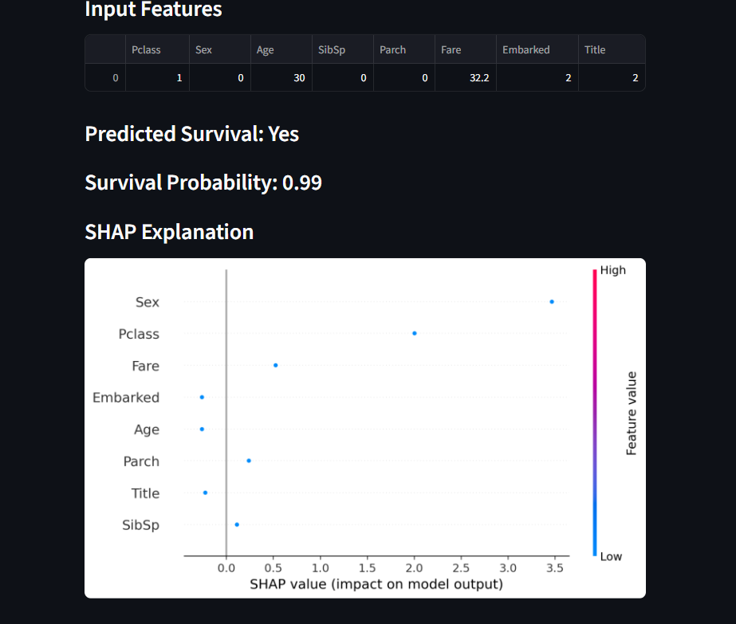
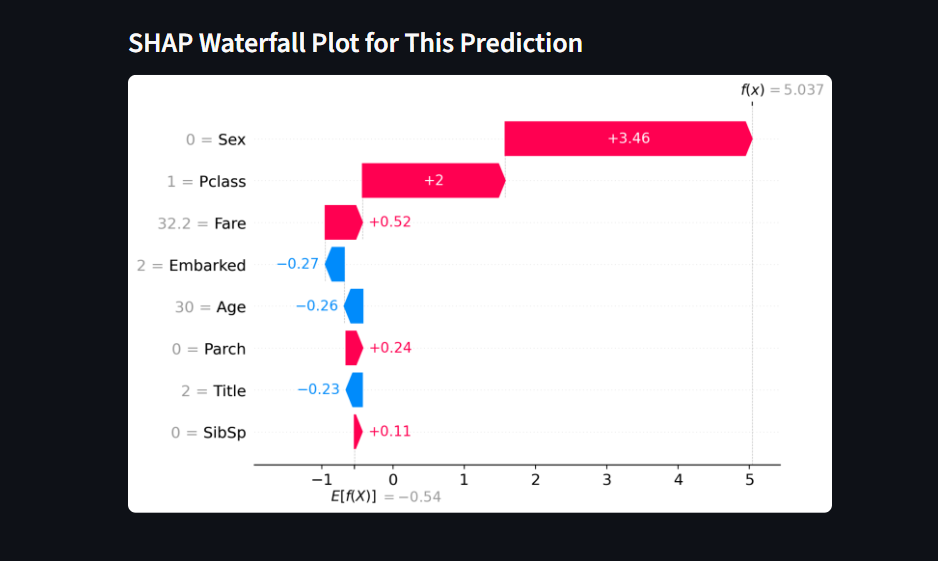

# 🚢 Titanic Survival Prediction App

**Decoding Survival: Harnessing Machine Learning and Streamlit for Titanic Predictions**

This interactive app uses machine learning models to predict the survival of Titanic passengers. The deployed model (XGBoost) is integrated with SHAP explainability tools to provide insights into the "why" behind each prediction.

---

## 🔍 Features

- Input passenger details and get real-time survival predictions.
- SHAP-based explainability (summary + waterfall plots).
- Built with **Streamlit**, powered by **XGBoost**, and explained using **SHAP**.

---
## 📷 App Interface

|Titanic Prediction App Interface  | SHAP Summary Plot for Titanic Features |SHAP Waterfall Plot Explaining Survival Prediction |
|----------------|-------------------|--------------------|
|  |  |  |

---

## 📊 Classifiers Evaluated

| Classifier             | Accuracy |
|------------------------|----------|
| Random Forest          | 0.825    |
| XGBoost (Deployed)     | 0.824    |
| Logistic Regression    | 0.802    |
| K-Nearest Neighbors    | 0.64     |
| Support Vector Machine | 0.62     |

---

## 📁 Dataset

This project uses the [Titanic Dataset by Yasser Hatab (Kaggle)](https://www.kaggle.com/datasets/yasserh/titanic-dataset).

⚠️ **Due to Kaggle licensing, the dataset is not included in this repo.**  
To run the notebook or app locally, please download the dataset manually and place it as:

```bash
Titanic-Dataset.csv

🚀 Getting Started

1. **Clone the repository**:
   ```bash
 git clone https://github.com/yourusername/titanic-prediction-app.git
 cd titanic-prediction-app
   ```
2. **Install dependencies:**:   
   ```commandline
    pip install -r requirements.txt
   ```
   ```
3. **Run the Streamlit app:**:   
   ```commandline
    streamlit run app_xgb.py
   ```

🔧 Files in This Repo

app_xgb.py: Streamlit application

titanic_starter.ipynb: Model training & SHAP explainability

xgb_model.joblib: Trained XGBoost model

requirements.txt: Python dependencies

## 👨‍💻 Author

Yoseph Negash

📧 yosephn22@gmail.com

📅 2025
